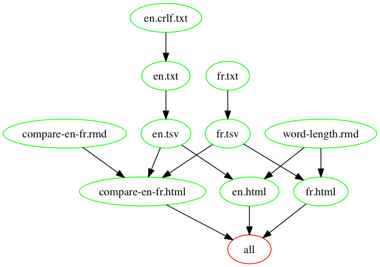

# Analyse the distribution of word lengths

This repository is an example of a data analysis pipeline using Make. It downloads lists of English and French word lists, calculates a table of word length frequency, and plots the two distributions.

## Dependency diagram of the [Makefile](https://github.com/sjackman/makefile-example/blob/master/Makefile)

Created using [makefile2graph](https://github.com/lindenb/makefile2graph)

## RMarkdown Reports

+ [compare-en-fr.html](http://sjackman.ca/makefile-example/compare-en-fr.html)
+ [en.html](http://sjackman.ca/makefile-example/en.html)
+ [fr.html](http://sjackman.ca/makefile-example/fr.html)

## GitHub repository

https://github.com/sjackman/makefile-example/
